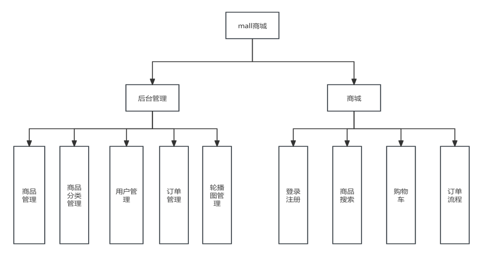
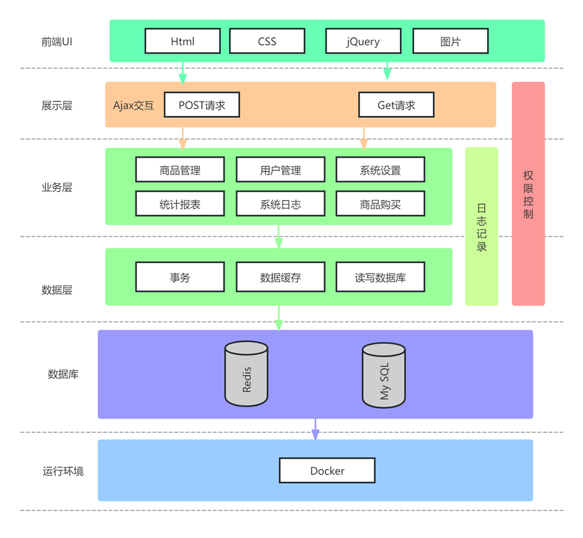

# Jiang Mall

## 介绍
一款基于 Spring Boot 3 开发的商城系统

## 重要提示

**第一次初始化项目时，由于数据库量过大，可能需要耗时较长（由于有大量地理数据，预计10分钟左右），请耐心等待。**


如果初始化失败，请手动导入数据库脚本(位于/data目录下)，并把修改配置文件application.properties。
```properties
spring.flyway.enabled = false
```

**docker部署支持本地文件上传需要修改路径为"/home/upload/"，正常使用可以自定义，但需要有对应权限。**

## 开发工具
IntelliJ IDEA 2024.2.3 (Ultimate Edition)

Navicat Premium Lite 版本17.1.5(简体中文)

## 系统功能模块图



## 系统架构图



## 技术栈

- **前端**：JavaScript
- **后端**：Spring Boot 3.3.4 (Oracle OpenJDK 17.0.11)
- **数据库**：MySQL 8.0.36 (MySQL Community Server) 
- **缓存**：Redis 6.2.16
- **构建工具**：Maven 3.8.4
- **版本控制**：Git

#### 第三方API

1. 使用[ipify](https://www.ipify.org/)实现公网ip获取
    ```javascript
    <script type="application/javascript">
        let ip = "";
        function getIP(json) {
            ip = json.ip
        }
    </script>
    <script type="application/javascript" src="https://api64.ipify.org?format=jsonp&callback=getIP"></script>
   ```

#### 后端

详见各模块的README.md

#### 数据库设计

1. MySQL数据库设计

2. Redis数据库设计

| 数据库名 | 用途        | 备注 |
|------|-----------|----|
| db0  | product   |    |
| db1  | user      |    |
| db2  | oauth     |    |
| db3  | cart      |    |
| db4  | order     |    |
| db5  | notice    |    |
| db6  | home      |    |
| db7  | temporary |    |
| db8  | seckill   |    |
| db9  | search    |    |

#### 前端

1. bootstrap 5.3.3

2. jquery 3.7.1

3. adminlte 4.0.0

4. bootstrap-icons 1.11.3

5. crypto-js 4.2.0

6. apexcharts 3.50.0

7. jsvectormap 1.5.3

8. popper 2.11.8

9. sortable 1.15.3

10. source-sans 3_5.1.0

11. overlayscrollbars 2.10.0

12. wangeditor 5.1.23


#### 数据源

1. 中国地址行政区划数据来源：https://github.com/kakuilan/china_area_mysql
（经过裁剪）

2. 商品分类数据来源：https://www.taobao.com/

## 安装教程

1. 一键部署（直接拉起公共镜像部署，**注意：公共镜像可能不是最新版本**）
   ```shell
   wget -qO- https://download.jiangrongjun.top/one-touch.sh | bash
   ```
2. 编译部署（使用Docker部署，需要自定义数据库参考[部署文档](/doc/DeploymentManual.md)进行修改）
   ```shell
   wget -qO- https://download.jiangrongjun.top/compile.sh | bash
   ```
3. 编译部署（使用Jar包部署）
   
   详情请查看[部署文档](/doc/DeploymentManual.md)
## 测试环境

1. 操作系统：CentOS Stream 9 x86_64
2. 内核版本：5.14.0-513.el9.x86_64
3. MySQL版本：8.0.36
4. Docker版本：27.3.1
5. Docker-compose版本：v2.29.7

## 参与贡献

1.  Fork 本仓库
2.  新建 Feat_xxx 分支
3.  提交代码
4.  新建 Pull Request